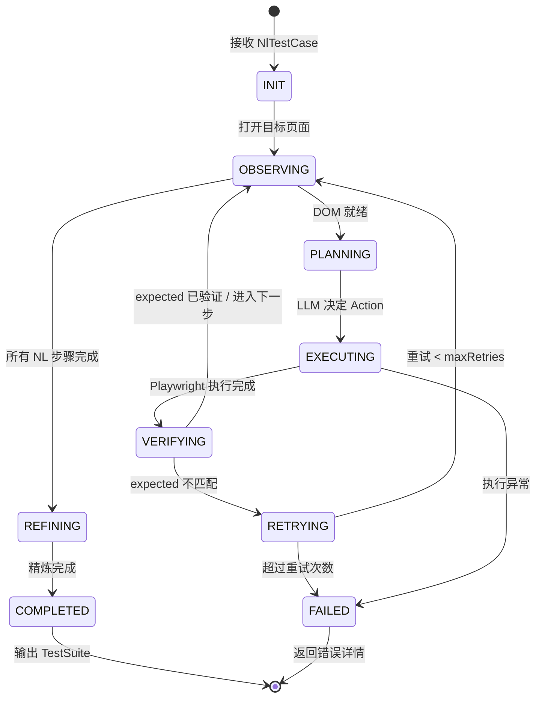

# AI-Driven Recording Engine - Architecture & Design

AI-Driven Recording Engine 是一个基于 **LLM Agent + Tool Calling** 的智能录制系统。它将传统的"人工录制"升级为"AI 驱动录制"——AI Agent 读取自然语言测试用例（NL Test Case），自主决策并操作浏览器完成录制，自动产出结构化可执行的 TestStep。

---

## 1. System Overview

### 1.1 Background & Motivation

现有系统的两条用例生成路径存在断层：

| 路径 | 输入 | 产出 | 问题 |
|:---|:---|:---|:---|
| **Recording** | 人工操作 | 结构化 `TestStep[]` + Element Repository | 依赖人工，无法批量 |
| **AI Test Gen** | 需求 | `NlTestCase`（自然语言 steps） | 不可直接执行 |

**AI-Driven Recording Engine** 填补这个断层：AI Agent 读取 `NlTestCase`，直接控制 Playwright 浏览器执行操作，录制引擎自动捕获结构化步骤，再经过 AI 精炼（Refine）输出生产就绪的 `TestSuite`。

### 1.2 Core Architecture

```mermaid
graph TB
    subgraph "Input"
        NL[NL Test Case<br/>from AI Test Gen]
    end

    subgraph "AI-Driven Recording Pipeline"
        direction TB
        AGENT[AI Agent Controller<br/>LLM + Tool Calling]
        OBSERVER[Observer<br/>DOM 感知 + 截图]
        RECORDER[Recording Engine<br/>Playwright Recorder<br/>复用现有模块]
    end

    subgraph "Output"
        RAW[原始 TestStep[]<br/>+ Element Repository]
    end

    subgraph "AI Refiner"
        REFINE[Refiner LLM<br/>合并/去重/断言补全/参数化]
    end

    subgraph "Final"
        SUITE[TestSuite<br/>生产就绪]
        TB[TestBuilder<br/>人工复核/编辑]
    end

    NL --> AGENT
    AGENT -->|Tool Call| OBSERVER
    OBSERVER -->|Page Context| AGENT
    AGENT -->|Playwright Action| RECORDER
    RECORDER --> RAW
    RAW --> REFINE
    REFINE --> SUITE
    SUITE --> TB
    TB -->|人审/编辑| SUITE
```

### 1.3 Dual Guarantee（双重保障）

| 层 | 保障 | 机制 |
|:---|:---|:---|
| **录制期** | 步骤结构化 + 选择器多策略 | `RecordingManager` 实时捕获 `TestStep`；Observer 提取完整属性供 Refiner 生成多策略选择器 |
| **精炼期** | AI 二次优化 | Refiner LLM 合并冗余、补全断言、参数化数据、标记低置信度步骤 |
| **人工期** | 人工复核 | TestBuilder 中可视化编辑、回放验证（复用现有功能） |

---

## 2. Pipeline Architecture

### 2.1 Agent Loop

```
┌────────────────────────────────────────────────────────────────────┐
│                    AI Agent Loop (ReAct)                            │
│                                                                     │
│  ┌─────────┐   ┌──────────┐   ┌──────────┐   ┌───────────────┐   │
│  │ Observe │→→→│  Think   │→→→│   Act    │→→→│ Record + Wait │   │
│  │ (感知)   │   │ (规划)    │   │ (执行)    │   │ (录制 + 验证)  │   │
│  └─────────┘   └──────────┘   └──────────┘   └───────────────┘   │
│       ↑                                                           │
│       └───────────────────────────────────────────────────────────┘
│                             循环至 NL 步骤完成或失败
└────────────────────────────────────────────────────────────────────┘
```

每个 NL 步骤的完整生命周期：

```
Step i: "点击登录按钮，跳转到首页"

  1. Observe
     ├── page.url() → "http://localhost/login"
     ├── interactiveElements[] → 所有可交互元素（按钮、输入框、链接...）
     └── screenshot (可选，用于 VLM 模式)

  2. Think (LLM + Tool Calling)
     ├── 用户目标: "点击登录按钮"
     ├── expected: "跳转到首页"
     ├── 匹配元素: button[name='登录'] / [data-testid='login-btn']
     └── 选择工具: click(selector="button[name='登录']")

  3. Act
     ├── 执行 click("button[name='登录']")
     ├── 等待导航: waitForNavigation()
     └── 记录结果: success / failed

  4. Record
     ├── RecordingManager 自动捕获:
     │   TestStep { action: "click", target: "loginPage.loginBtn", ... }
     │   UIElement { name: "loginBtn", selectorType: "role", value: "button[name='登录']", ... }
     └── 验证 expected:
         ├── page.url() 包含 "/home" → PASS
         └── 否则 → 重试或修正策略
```

### 2.2 State Machine



### 2.3 Agent Skills（可调用工具）

Agent 通过 Tool Calling 调用以下 Playwright 操作：

| Tool | 参数 | 说明 |
|:---|:---|:---|
| `click` | `selector: string` | 点击元素，支持 role/text/testid/css 选择器 |
| `fill` | `selector, value: string` | 填写输入框 |
| `goto` | `url: string` | 页面导航 |
| `selectOption` | `selector, value: string` | 下拉选择 |
| `press` | `selector?: string, key: string` | 按键操作 |
| `hover` | `selector: string` | 悬停 |
| `check` / `uncheck` | `selector: string` | 复选框操作 |
| `waitForSelector` | `selector, state, timeout` | 等待元素 |
| `waitForNavigation` | `waitUntil?: string` | 等待页面导航完成 |
| `scrollIntoView` | `selector: string` | 滚动到元素 |
| `evaluate` | `code: string` | 执行 JS 脚本（高级） |

> [!IMPORTANT]
> **选择器优先级**：Agent 被引导优先使用语义化选择器，顺序为：`role > testid > text > name > css`。这确保了生成的测试步骤具有最大健壮性。

---

## 3. Core Component Design

### 3.1 Agent Controller（核心编排器）

**路径**：`server/modules/ai-driven-recorder/agent/agent-controller.ts`

```typescript
class AgentController {
  private readonly llm: AIProvider;
  private readonly browser: Browser;
  private readonly page: Page;
  private readonly recorder: RecordingManager;
  private readonly refiner: Refiner;

  async run(nlCase: NlTestCase, projectId: string, options?: {
    headless?: boolean;
    maxRetriesPerStep?: number;
  }): Promise<TestCase> {
    // Phase 1: Navigate to starting page
    await this.navigateToStart(nlCase);

    // Phase 2: Execute NL steps through AI Agent loop
    for (const nlStep of nlCase.steps) {
      await this.executeNlStep(nlStep);
    }

    // Phase 3: Refine recorded steps
    const rawSteps = this.recorder.flush();
    const refinedSteps = await this.refiner.refine(rawSteps, nlCase);

    // Phase 4: Build and save TestCase
    return this.buildTestCase(refinedSteps, nlCase);
  }

  private async executeNlStep(nlStep: NlTestCaseStep): Promise<void> {
    const maxRetries = this.options.maxRetriesPerStep ?? 2;

    for (let attempt = 0; attempt <= maxRetries; attempt++) {
      // 1. Observe
      const pageContext = await this.observe();

      // 2. Plan (LLM decides next action)
      const plan = await this.llm.chat({
        messages: [
          { role: 'system', content: buildPlannerPrompt(nlStep, pageContext, this.history) },
        ],
        tools: PLAYWRIGHT_TOOLS,
        toolChoice: 'required',
      });

      // 3. Act
      const result = await this.playwrightExecutor.execute(plan.toolCall);

      // 4. Verify expected outcome
      const verified = await this.verifyExpected(nlStep.expected, result);
      if (verified) break;

      if (attempt < maxRetries) {
        // Update history for corrective re-planning
        this.history.push({ step: nlStep, attempt, plan, result, error: 'expected_not_met' });
      }
    }
  }
}
```

### 3.2 Observer（页面感知器）

**路径**：`server/modules/ai-driven-recorder/agent/observer.ts`

Observer 负责将当前页面状态转化为 LLM 可理解的上下文。关键设计是**不要将所有 DOM 节点都发给 LLM**，而是提取精炼的可交互元素信息：

```typescript
interface PageContext {
  url: string;
  title: string;
  interactiveElements: InteractiveElement[];
  // 可选：base64 截图（用于多模态 VLM）
  screenshot?: string;
}

interface InteractiveElement {
  tag: string;              // button, input, a, select...
  text: string;             // 元素的可见文本（截断至 50 字符）
  selector: string;         // 最佳选择器（role/testid/css）
  attributes: {             // 关键属性
    id?: string;
    name?: string;
    type?: string;
    placeholder?: string;
    role?: string;
    testId?: string;
    href?: string;
    value?: string;
  };
  rect: {                   // 位置信息
    x: number; y: number;
    width: number; height: number;
  };
  isVisible: boolean;
  isEnabled: boolean;
  isEditable: boolean;
  framePath?: string[];     // iframe 路径
}
```

**提取策略**：

```typescript
async function observePage(page: Page): Promise<PageContext> {
  const interactiveElements = await page.evaluate(() => {
    // 只提取用户可能交互的元素
    const selectors = `
      button, a, input, select, textarea,
      [role="button"], [role="link"], [role="checkbox"],
      [role="tab"], [role="menuitem"],
      [onclick], [data-testid]
    `;

    return Array.from(document.querySelectorAll(selectors))
      .filter(el => {
        const rect = el.getBoundingClientRect();
        return rect.width > 0 && rect.height > 0;
      })
      .map(el => ({
        tag: el.tagName.toLowerCase(),
        text: (el.textContent ?? '').trim().slice(0, 50),
        attributes: {
          id: el.id || undefined,
          name: el.getAttribute('name') ?? undefined,
          type: el.getAttribute('type') ?? undefined,
          placeholder: el.getAttribute('placeholder') ?? undefined,
          role: el.getAttribute('role') ?? undefined,
          testId: el.getAttribute('data-testid') ?? undefined,
          href: el.getAttribute('href') ?? undefined,
          value: (el as HTMLInputElement).value ?? undefined,
        },
        rect: { x: rect.x, y: rect.y, width: rect.width, height: rect.height },
        isVisible: el.checkVisibility?.() ?? true,
        isEnabled: !(el as HTMLInputElement).disabled,
        isEditable: !(el as HTMLInputElement).readOnly,
      }));
  });

  const url = page.url();
  const title = await page.title();

  return { url, title, interactiveElements };
}
```

> [!NOTE]
> **VLM 模式**：当配置了多模态模型（如 GPT-4V），可以将整页截图 + 用户坐标一起发给 LLM，让模型直接"看到"页面布局。这在复杂页面布局中显著提升元素匹配准确率。

### 3.3 Recorder（录制集成）

**关键设计**：不重写录制逻辑，复用现有 `agent/recorder/` 的 `RecordingManager`。

```typescript
// 在 Agent Controller 初始化时启动录制
import { startRecording } from '../../../agent/recorder/index.ts';

// 启动 Playwright + 录制适配器
await startRecording(targetUrl, projectId, undefined,
  (element) => { /* 元素回调 - 自动建立 Element Repository */ },
  (stepInfo) => { /* 步骤回调 - 实时接收 TestStep */ },
  (apiInfo) => { /* API 回调 - 捕获 API 请求 */ },
  (state) => { /* 状态回调 */ },
  'all',   // 模式: UI + API 同时录制
);

// AI Agent 控制同一个 Page 对象进行操作
// 录制引擎自动捕获每一步操作 → 生成 TestStep + UIElement
```

这样做的优势：
- **零重复开发**：选择器生成、合并逻辑、WebSocket 推送、Element Repository 更新全部复用
- **双向保证**：Agent 执行的操作 = 录制捕获的操作，不会有偏差
- **一致性**：AI 驱动产生的 TestStep 与人工录制的 TestStep 结构完全一致

### 3.4 Refiner（精炼器）

**路径**：`server/modules/ai-driven-recorder/refiner/refiner.ts`

Refiner 是 AI-Driven Recording Pipeline 的"品控环节"，对录制产生的原始步骤进行二次优化：

```typescript
class Refiner {
  private readonly llm: AIProvider;

  async refine(rawSteps: TestStep[], nlCase: NlTestCase): Promise<RefinedStep[]> {
    const prompt = `
你是一个测试自动化专家。请优化以下录制产生的测试步骤。

【原始录制步骤】
${JSON.stringify(rawSteps, null, 2)}

【对应的自然语言测试用例】
标题: ${nlCase.title}
NL 步骤:
${nlCase.steps.map((s, i) => `  Step ${i + 1}: "${s.action}" → expected: "${s.expected}"`).join('\n')}

【优化要求】
1. 去重：合并连续对同一元素的同类操作（如 click → fill 同一输入框）
2. 补全断言：从 NL expected 推断断言
   - "跳转到/打开/进入" → UI_PAGE_URL CONTAINS
   - "显示/出现/可见" → UI_ELEMENT_VISIBLE EQUALS true
   - "提示/显示文本" → UI_TEXT CONTAINS
   - "按钮/元素禁用" → UI_ELEMENT_ENABLED EQUALS false
3. 多策略选择器：为每个 target 生成备选选择器数组
4. 参数化：检测硬编码数据（如 "user@test.com"），提取为变量引用
5. 标记低置信度步骤（confidence < 0.7 建议人工审核）

输出 JSON 格式，遵循以下 schema：
{
  "steps": [
    {
      "action": "click",
      "target": "loginPage.loginBtn",
      "targetStrategies": [{ "type": "role", "value": "..." }, { "type": "testid", "value": "..." }],
      "data": "{{email}}",
      "description": "点击登录按钮",
      "assertions": [{ "source": "UI_PAGE_URL", "operator": "CONTAINS", "expectedValue": "/home" }],
      "extractors": [...],
      "confidence": 0.95,
      "metadata": { "refined": true }
    }
  ]
}
`;

    const response = await this.llm.chat({
      messages: [
        { role: 'system', content: REFINER_SYSTEM_PROMPT },
        { role: 'user', content: prompt },
      ],
      responseFormat: { type: 'json_object' },
      temperature: 0.1,
    });

    return RefinedStepsSchema.parse(response).steps;
  }

  // 为步骤生成多策略选择器（选择器降级链）
  generateSelectorStrategies(element: UIElement): SelectorStrategy[] {
    const strategies: SelectorStrategy[] = [];

    // 优先级 1: role 选择器（最健壮）
    if (element.metadata?.recorder?.locator?.kind === 'getByRole') {
      strategies.push({
        type: 'role',
        value: `${element.metadata.recorder.locator.role}${element.metadata.recorder.locator.name ? `[name='${element.metadata.recorder.locator.name}']` : ''}`,
      });
    }

    // 优先级 2: data-testid
    if (element.metadata?.recorder?.locator?.kind === 'getByTestId') {
      strategies.push({ type: 'testid', value: `[data-testid='${element.metadata.recorder.locator.text}']` });
    }

    // 优先级 3: text 选择器
    if (element.name) {
      strategies.push({ type: 'text', value: element.name });
    }

    // 优先级 4: CSS 兜底
    strategies.push({ type: 'css', value: element.value });

    return strategies;
  }
}
```

**Refiner 输出示例**：

```javascript
// 输入（录制原始步骤）：
[
  { action: "click", target: "button[name='登录']", ... },
  { action: "fill", target: "input[name='username']", data: "test@email.com", ... },
  { action: "fill", target: "input[name='password']", data: "Test1234!", metadata: { recorder: { raw: { value: "Test1234!" } } } },
  { action: "click", target: "button[name='登录']", ... },
]

// 输出（精炼后）：
[
  { action: "fill", target: "loginPage.usernameField", data: "{{email}}",
    assertions: [{ source: "UI_ELEMENT_VISIBLE", operator: "EQUALS", expectedValue: "true" }],
    targetStrategies: [{ type: "role", value: "textbox[name='用户名']" }, { type: "testid", value: "[data-testid='username']" }]
  },
  { action: "fill", target: "loginPage.passwordField", data: "{{password}}",
    targetStrategies: [{ type: "role", value: "textbox[name='密码']" }, { type: "testid", value: "[data-testid='password']" }]
  },
  { action: "click", target: "loginPage.loginBtn",
    assertions: [{ source: "UI_PAGE_URL", operator: "CONTAINS", expectedValue: "/home" }],
    targetStrategies: [{ type: "role", value: "button[name='登录']" }, { type: "testid", value: "[data-testid='login-btn']" }]
  }
]
```

---

## 4. Planner Prompt System

### 4.1 System Prompt

这是 Agent Planner 的核心，决定了 LLM 理解任务和执行操作的质量：

```typescript
export const PLANNER_SYSTEM_PROMPT = `
你是一个浏览器自动化测试 Agent。你的任务是根据自然语言测试步骤，在页面上执行对应操作。

【核心规则】
1. 每次只执行一个操作（单一 tool call）
2. 观察后思考，思考后执行
3. 如果你不确定选择哪个元素，选择最匹配的那个并给出低置信度标记
4. 如果无法找到匹配元素，尝试滚动页面、切换 iframe，或返回失败

【操作类型】（通过 Tool Calling 调用）
- click(selector, options) — 点击元素
- fill(selector, value) — 填写输入框（优先于 press + type）
- goto(url) — 页面导航
- selectOption(selector, value) — 下拉选择
- press(selector, key) — 按键（仅用于 Tab/Escape/Enter 等特殊键）
- hover(selector) — 悬停
- check(selector) / uncheck(selector) — 复选框
- waitForSelector(selector, state, timeout) — 等待元素（state: visible|hidden|attached）
- waitForNavigation(waitUntil) — 等待页面导航完成
- scrollIntoView(selector) — 滚动到元素可见
- evaluate(code) — 执行 JS（仅高级场景）

【选择器优先级】（请按此顺序选择）
1. role: "button[name='登录']", "textbox[name='用户名']", "link[name='首页']"
2. testid: "[data-testid='login-btn']"
3. label: "text=用户名"
4. name: "input[name='username']"
5. placeholder: "input[placeholder='请输入手机号']"
6. css（最后手段）: "#login-btn" 或 "form > button.primary"

【决策流程】
For each NL step:
1. 理解 NL action 和 expected
2. 观察页面上提供的 interactiveElements 列表
3. 找到最匹配的元素（基于 text、placeholder、role、name 等）
4. 选择合适的工具
5. 如果是导航操作（click 链接/按钮后页面变化），添加 waitForNavigation
6. 如果 expected 描述新页面状态，添加对应的验证等待

【错误处理】
- 如果操作超时：标记失败，提供页面状态快照
- 如果元素不可见：先 scrollIntoView 再操作
- 如果元素被覆盖：尝试 click({ force: true }) 或先点击其他元素
- 连续 3 次失败：终止当前 NL 步骤，标记为 failed
`;
```

### 4.2 Tool Definitions

```typescript
// OpenAI Function Calling / Tool 格式
export const PLAYWRIGHT_TOOLS: ToolDefinition[] = [
  {
    name: 'click',
    description: '点击页面元素。优先使用 role 选择器（如 button[name="提交"]）或 data-testid',
    parameters: {
      type: 'object',
      properties: {
        selector: {
          type: 'string',
          description: 'Playwright 选择器。推荐格式: button[name="文本"] / link[name="文本"] / [data-testid="id"] / text="文本"',
        },
        force: { type: 'boolean', description: '是否强制点击（绕过可操作性检查）' },
      },
      required: ['selector'],
    },
  },
  {
    name: 'fill',
    description: '填写输入框。先尝试 clear() 再填入新值',
    parameters: {
      type: 'object',
      properties: {
        selector: { type: 'string', description: '输入框选择器' },
        value: { type: 'string', description: '要填入的值' },
      },
      required: ['selector', 'value'],
    },
  },
  // ... 其他工具（goto, selectOption, press, hover, check, uncheck, waitForSelector, waitForNavigation 等）
];
```

---

## 5. Database Schema

```sql
-- 运行记录
CREATE TABLE ai_driven_recording_runs (
  id TEXT PRIMARY KEY,
  project_id TEXT NOT NULL,
  nl_case_id TEXT NOT NULL,
  status TEXT NOT NULL DEFAULT 'running',  -- running | completed | failed | refining
  started_at TEXT NOT NULL DEFAULT (datetime('now')),
  completed_at TEXT,
  total_steps INTEGER NOT NULL DEFAULT 0,
  completed_steps INTEGER NOT NULL DEFAULT 0,
  failed_steps INTEGER NOT NULL DEFAULT 0,
  result_case_id TEXT REFERENCES test_cases(id) ON DELETE SET NULL,
  error TEXT,

  FOREIGN KEY (nl_case_id) REFERENCES natural_language_test_cases(id)
);

-- Agent 操作日志（用于调试和审计）
CREATE TABLE ai_driven_recording_logs (
  id TEXT PRIMARY KEY,
  run_id TEXT NOT NULL REFERENCES ai_driven_recording_runs(id) ON DELETE CASCADE,
  nl_step_index INTEGER NOT NULL,
  phase TEXT NOT NULL,           -- observe | plan | act | verify | retry
  llm_thought TEXT,              -- LLM 的思考过程
  tool_name TEXT,                -- 调用的工具名
  tool_input TEXT,               -- 工具参数（JSON）
  tool_output TEXT,              -- 工具返回（JSON）
  page_url TEXT,                 -- 操作时的页面 URL
  passed_verification INTEGER,   -- expected 验证是否通过
  recorded_step_id TEXT,         -- 录制引擎捕获的 step ID
  latency_ms INTEGER,
  created_at TEXT NOT NULL DEFAULT (datetime('now'))
);

CREATE INDEX idx_ai_recording_run ON ai_driven_recording_logs(run_id);
CREATE INDEX idx_ai_recording_status ON ai_driven_recording_runs(status);
```

---

## 6. API Design

### 6.1 REST Endpoints

```typescript
// POST /api/projects/:projectId/ai-recorder/run
interface RunRequest {
  nlCaseId: string;
  options?: {
    headless?: boolean;              // 默认 true（生产环境建议无头）
    maxRetriesPerStep?: number;      // 默认 2
    timeoutPerStep?: number;         // 默认 60000ms
    viewport?: { width: number; height: number };
    providerConfigName?: string;     // 复用 AI Test Gen 的 Provider 配置
    model?: string;
  };
}

interface RunResponse {
  runId: string;
  status: 'started';
}

// POST /api/projects/:projectId/ai-recorder/run-batch
interface BatchRunRequest {
  nlCaseIds: string[];
  options?: RunRequest['options'];
}

interface BatchRunResponse {
  runIds: string[];
  status: 'started';
}

// GET /api/projects/:projectId/ai-recorder/runs/:runId
interface RunStatusResponse {
  runId: string;
  nlCaseId: string;
  status: 'running' | 'refining' | 'completed' | 'failed';
  progress: {
    total: number;
    completed: number;
    failed: number;
    currentStep: string;
  };
  result?: {
    caseId: string;
    suiteId: string;
  };
  error?: string;
}

// GET /api/projects/:projectId/ai-recorder/runs
// 列出当前项目的所有录制运行历史
```

### 6.2 SSE Stream

```typescript
// GET /api/projects/:projectId/ai-recorder/runs/:runId/stream

// 事件类型
interface SSEEvents {
  'run:start': { runId: string; nlCaseId: string; totalSteps: number };

  'step:observe': { stepIndex: number; url: string; elementCount: number };
  'step:plan': { stepIndex: number; thought: string; toolName: string; toolInput: any };
  'step:act': { stepIndex: number; toolName: string; durationMs: number };
  'step:verify': { stepIndex: number; passed: boolean; expected: string; actual: string };
  'step:retry': { stepIndex: number; attempt: number; error: string };
  'step:complete': { stepIndex: number; recordedStep: TestStep };

  'phase:refine': { message: string };
  'phase:save': { caseId: string; suiteId: string };

  'run:complete': { runId: string; caseId: string; suiteId: string; durationMs: number };
  'run:error': { runId: string; error: string; recoverable: boolean };
}
```

---

## 7. Module Structure

```
server/modules/ai-driven-recorder/
├── index.ts                    # 模块入口，导出 router
├── controller.ts               # REST API 控制器
├── schema.ts                   # 请求/响应 Zod Schema
├── repository.ts               # DB 读写（runs/logs）
│
├── agent/
│   ├── agent-controller.ts     # 核心编排器：Agent 循环、生命周期
│   ├── planner.ts              # LLM Prompt 构建 + Tool Calling
│   ├── observer.ts             # 页面状态感知（DOM 提取、截图）
│   ├── executor.ts             # Playwright 执行封装
│   └── recorder.ts             # 录制引擎集成（复用现有 RecordingManager）
│
├── refiner/
│   ├── refiner.ts              # AI Refiner 核心
│   └── prompts.ts              # Refiner 的系统提示词
│
├── prompts/
│   ├── planner.ts              # Planner System Prompt + Tool Definitions
│   └── refiner.ts              # Refiner System Prompt
│
└── __tests__/
    ├── agent-controller.test.ts
    ├── planner.test.ts
    └── observer.test.ts
```

---

## 8. Key Implementation Details

### 8.1 录制引擎集成要点

```typescript
// agent/recorder.ts - 录制集成适配层
export async function startAgentRecording(
  projectId: string,
  page: Page,
  onStep: (step: TestStep) => void,
  onElement: (element: UIElement) => void,
  onApi: (api: ApiRecordedInfo) => void,
): Promise<() => void> {
  // 复用现有的 RecordingManager 机制，但不再由它控制 browser
  // AI Agent Controller 自己管理 Browser/Page 生命周期
  // RecordingManager 只负责：监听 Playwright 事件 → 转成 TestStep

  const adapter = new PlaywrightRecorderAdapter({
    onActionAdded: (page, actionInContext) => {
      const step = translateAction(actionInContext);
      if (!step) return;

      // 走现有的 consolidation 逻辑
      for (const consolidated of consolidator.add(step)) {
        // 构建 TestStep（复用 emitConsolidatedStep 的逻辑）
        const testStep = buildStepFromPayload(consolidated);
        onStep(testStep);
      }
    },
  });

  adapter.start(/* context */);

  return () => { adapter.stop(); };
}
```

### 8.2 变量提取与参数化

Refiner 自动识别硬编码数据并提取为变量：

```typescript
// 检测模式
const PARAMETERIZABLE_PATTERNS = [
  // 邮箱
  { pattern: /^[\w.+-]+@[\w-]+\.[\w.]+$/, varName: 'email' },
  // 手机号
  { pattern: /^1[3-9]\d{9}$/, varName: 'phone' },
  // URL
  { pattern: /^https?:\/\/.+/, varName: 'url' },
  // 数字 ID
  { pattern: /^\d{8,}$/, varName: 'id' },
];

function detectVariables(data: string): { value: string; extractor?: VariableExtractor } {
  for (const { pattern, varName } of PARAMETERIZABLE_PATTERNS) {
    if (pattern.test(data)) {
      return {
        value: `{{${varName}}}`,
        extractor: {
          id: randomId('ext'),
          name: varName,
          source: 'UI_VALUE',
          scope: 'CASE',
        },
      };
    }
  }
  return { value: data };
}
```

### 8.3 断言推断映射

```typescript
// 从 NL expected 推断断言
const ASSERTION_INFERENCE_MAP = [
  // 页面导航类
  { pattern: /跳转到|打开|进入|转到|导航到/, build: (text: string): StepAssertion[] => [
    { id: randomId('ast'), source: 'UI_PAGE_URL', operator: 'CONTAINS', expectedValue: extractPath(text) },
  ]},
  // 可见性类
  { pattern: /显示|出现|可见|展示|看到/, build: () => [
    { id: randomId('ast'), source: 'UI_ELEMENT_VISIBLE', operator: 'EQUALS', expectedValue: 'true' },
  ]},
  // 禁用类
  { pattern: /禁用|不可点击|灰色|灰化/, build: () => [
    { id: randomId('ast'), source: 'UI_ELEMENT_ENABLED', operator: 'EQUALS', expectedValue: 'false' },
  ]},
  // 文本断言类
  { pattern: /提示.*|.*错误|成功.*|失败.*/, build: (text: string): StepAssertion[] => [
    { id: randomId('ast'), source: 'UI_TEXT', operator: 'CONTAINS', expectedValue: extractAssertText(text) },
  ]},
];
```

---

## 9. Integration with Existing Modules

| 现有模块 | 集成方式 |
|:---|:---|
| **AI Test Gen** (`server/modules/ai-test-gen`) | 复用 `AIProvider` 接口；AI Test Gen 产出的 `NlTestCase` 作为本模块输入 |
| **Recording Engine** (`agent/recorder/`) | 复用 `RecordingManager` + `StepConsolidator` + `PlaywrightRecorderAdapter` |
| **Element Repository** (`client/features/elements/`) | 录制过程中自动建立/更新（与人工录制行为一致） |
| **Test Builder** (`client/features/tests/`) | 生成的 `TestSuite` + `TestCase` 直接进入 TestBuilder |
| **SSE Gateway** (`server/modules/ai-test-gen/sse-gateway.ts`) | 复用 SSE 推送方案，前端显示实时进度 |
| **Provider Configs** (`server/modules/provider-configs/`) | 复用 LLM 配置（模型、Endpoint、API Key） |
| **Execution Engine** (`server/modules/execution/`) | 生成的 `TestStep[]` 可直接被 `UIExecutor` 执行 |

---

## 10. Risks & Mitigations

| 风险 | 严重度 | 缓解措施 |
|:---|:---|:---|
| LLM 选错元素 | High | 1. Observer 提供结构化元素上下文，减少歧义 2. 多策略选择器兜底 3. expected 验证不通过自动重试 |
| 动态页面/异步渲染 | Medium | Planner 自动插入 `waitForSelector` 等待关键元素出现；支持配置显式等待策略 |
| iframe / Shadow DOM | Medium | Observer 递归遍历 frame tree，生成带 framePath 的选择器；Executor 自动切换 frame |
| 复杂交互（拖拽、上传） | Medium | 首次实现仅支持基础操作；复杂操作标记 confidence < 0.7，提示人工录制补充 |
| LLM 调用成本 | Low | 并发限制；浏览器上下文复用；Observations 缓存；可选用低成本模型 |
| 录制时间过长 | Low | Per-step timeout（默认 60s）；全局 timeout；支持批量取消 |
| 密码/敏感数据暴露 | High | fill 操作中 password 类输入框的值会被 Refiner 自动提取为变量，不硬编码在步骤中 |

---

## 11. Usage Guide

### 11.1 单个 NL Case 录制

```typescript
// 前端 API 调用
const response = await api.post(`/api/projects/${projectId}/ai-recorder/run`, {
  nlCaseId: 'nlc_xxxx',
  options: {
    headless: true,
    maxRetriesPerStep: 2,
  },
});

const { runId } = response;

// 通过 SSE 监听进度
const sse = new EventSource(`/api/projects/${projectId}/ai-recorder/runs/${runId}/stream`);
sse.addEventListener('step:complete', (e) => {
  console.log('Step complete:', JSON.parse(e.data));
});
sse.addEventListener('run:complete', (e) => {
  const { caseId, suiteId } = JSON.parse(e.data);
  // 跳转到 TestBuilder 查看结果
  window.location.href = `/tests?suiteId=${suiteId}&caseId=${caseId}`;
});
```

### 11.2 批量录制

```typescript
// 批量生成一批 NL Case 的结构化测试
const response = await api.post(`/api/projects/${projectId}/ai-recorder/run-batch`, {
  nlCaseIds: ['nlc_001', 'nlc_002', 'nlc_003'],
  options: { headless: true },
});

// 每个 runId 独立 SSE 流，前端可并行展示进度列表
```

### 11.3 人工程复核

录制完成后，自动跳转到 TestBuilder。用户可以在 TestBuilder 中：

1. **查看**：每个步骤的 action/target/data/assertions
2. **编辑**：修改选择器、补充断言、调整数据
3. **回放**：点击"运行"验证步骤是否正确
4. **补充录制**：对低置信度步骤，使用现有的录制引擎手动录制修正
5. **审批**：确认后标记为 approved，加入正式测试集

---

## 12. Comparison: Recording Modes

| 维度 | 人工录制 | AI 驱动录制 | AI + 人工精炼（本方案） |
|:---|:---|:---|:---|
| 输入 | 手工操作 | NL Test Case | NL Test Case |
| 产出 | TestStep[] | TestStep[] + Refined | TestStep[] + Refined + 人审 |
| Element Repository | ✅ 自动建立 | ✅ 自动建立 | ✅ 自动建立 |
| 选择器质量 | ⭐⭐⭐⭐ | ⭐⭐⭐ | ⭐⭐⭐⭐⭐（Refiner + 人工） |
| 断言覆盖 | 无/需手动 | ⭐⭐⭐（LLM 推断） | ⭐⭐⭐⭐（Refiner + 人工补全） |
| 数据参数化 | 手动 | 自动（Refiner） | 自动 + 人工确认 |
| 批量能力 | ❌ 逐个录制 | ✅ 批量并行 | ✅ 批量 + 集中审核 |
| 人工成本 | 高 | 低（仅审核） | 中（审核 + 修正低置信度） |
| 执行成功率 | ⭐⭐⭐⭐⭐ | ⭐⭐⭐ | ⭐⭐⭐⭐（人工兜底） |

---

## 13. Roadmap

| Phase | 交付 | 工期 |
|:---|:---|---:|
| **P1 核心引擎** | Agent Controller + Observer + Planner + Executor 集成；单 NL Case 端到端跑通基础 click/fill/goto/select | 2-3 周 |
| **P2 Refiner** | Refiner LLM 优化、多策略选择器生成、断言补全、参数化识别 | 1-2 周 |
| **P3 健壮性** | 失败重试策略、iframe/Shadow DOM 支持、动态等待优化、VLM 多模态模式（可选） | 1-2 周 |
| **P4 前端集成** | SSE 实时进度展示、运行历史列表、TestBuilder 无缝衔接、人工复核工作流 | 1 周 |
| **P5 批量/调度** | 批量 NL Case 录制、并发控制、浏览器资源池、定时任务、用量统计 | 1 周 |

